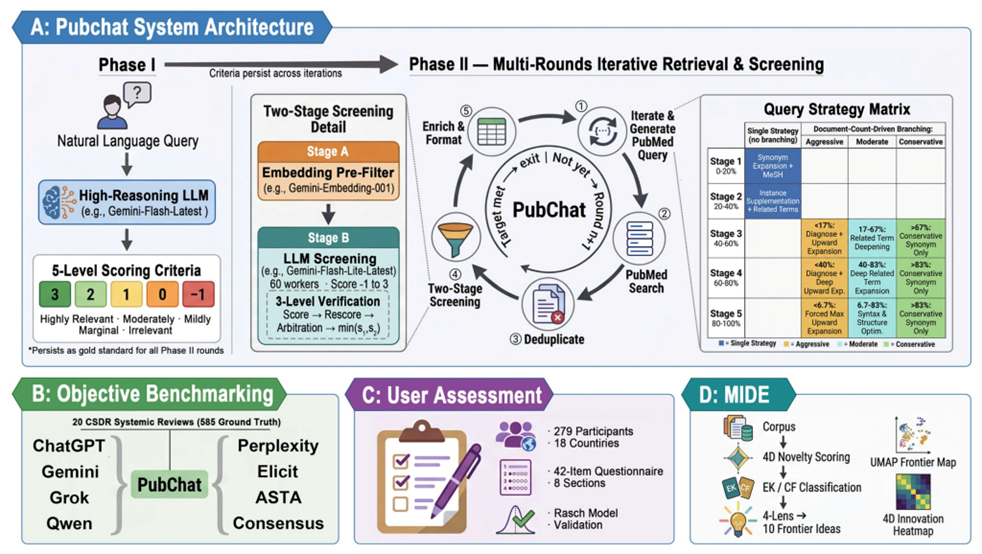
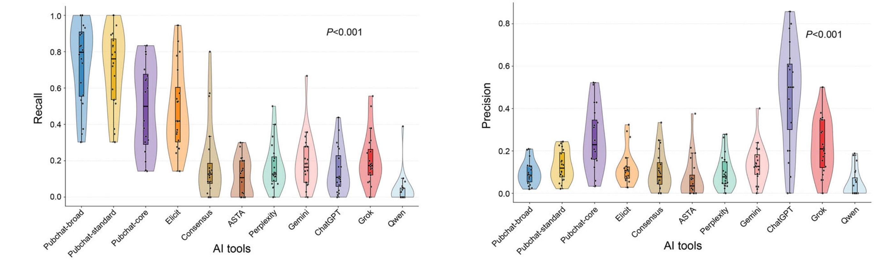
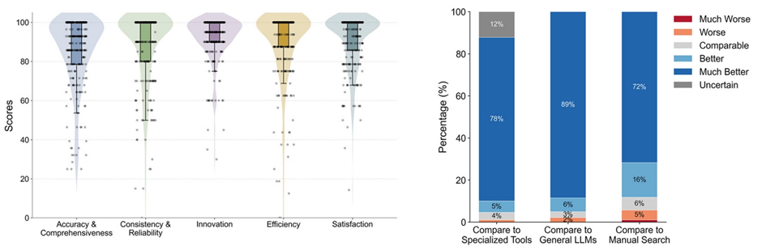

# PubChat: Traceable Multilingual Biomedical Literature Search

[中文](README.md) | [English](README.en.md)

PubChat is a biomedical literature retrieval and screening tool built on **PubMed**. Users can enter a research question in natural language, and the system handles question decomposition, search-query generation, iterative retrieval, deduplication, semantic pre-screening, large language model review, and relevance stratification.

Rather than asking a large language model to “generate references,” PubChat screens and ranks real records retrieved from PubMed. This makes every result traceable to the source database and reduces the risk of fabricated citations at the point of retrieval.

> PubChat is designed to assist literature retrieval and initial screening. It does not replace researchers’ professional judgment or a rigorous systematic-review workflow.

## Key Features

- **Natural-language search**: Enter a clinical or research question directly without writing a complex search strategy from scratch.
- **Dynamic iterative retrieval**: Automatically decompose the research question, generate and refine PubMed queries, and improve literature coverage.
- **Five-level relevance stratification**: Build relevance criteria from the research question and organize candidate articles into graded levels.
- **Semantic pre-screening and three-round review**: Combine semantic models and large language models in a multi-stage screening process to reduce manual reading workload.
- **Three retrieval modes**: Choose between broader coverage and a tighter focus on highly relevant literature.
  - `Broad`: prioritizes recall and is suitable for exploratory searches and the early stages of systematic reviews.
  - `Standard`: balances recall and precision for most routine research tasks.
  - `Core`: focuses on highly relevant literature for quickly identifying key evidence.
- **Eight output languages**: Chinese, English, Spanish, French, Portuguese, Italian, German, and Russian.
- **Local Docker deployment**: Use PubChat through a browser on a personal computer or within an institutional environment.



*PubChat system architecture and study design: the system generates five-level relevance criteria from a natural-language question, then stratifies the literature through dynamic query generation, iterative PubMed retrieval, deduplication, semantic pre-screening, and three-round LLM review (source: Fig. 5 of the original paper).*

## Why Use PubChat

### 1. Real, Verifiable Literature

All candidate articles come from PubMed rather than being generated by a model. Users can return to the database and verify each source using its PMID and related bibliographic information.

### 2. Adjustable Retrieval Strategies

Broad, Standard, and Core modes offer different recall-versus-precision trade-offs. They can support systematic reviews, project research, clinical question searches, and exploration of new research directions.

### 3. Less Repetitive Work

PubChat connects search-strategy design, iterative retrieval, deduplication, initial screening, and relevance assessment into a single workflow, allowing researchers to spend more time on full-text review, evidence appraisal, and scientific decision-making.

### 4. Evaluated in Real Research Workflows

The associated study used 585 PubMed-indexed articles from 20 Cochrane systematic reviews as the ground-truth set and compared PubChat with several leading AI literature-search tools. In that benchmark:

- PubChat-Broad achieved a recall of `0.734` and an nDCG of `0.441`, the highest values among the evaluated tools.
- PubChat-Core achieved the highest combined F1 and F2 scores.
- All articles retrieved by PubChat could be verified through PubMed, and no fabricated citations were observed in the benchmark.



*Recall and precision comparison between PubChat and leading AI literature-search tools (source: Fig. 2C-D of the original paper).*

The study also included 279 biomedical researchers from 18 countries and regions. PubChat scored above 80 in reliability, innovation, efficiency, user experience, and overall satisfaction.



*Key user-assessment results: distributions of scores across evaluation dimensions are shown on the left; subjective comparisons with specialized tools, general-purpose LLMs, and manual searching are shown on the right (source: Fig. 4D-E of the original paper).*

> These findings come from the benchmark and user study described in the paper. They do not guarantee identical performance across every topic, network environment, or model configuration.

## Use Cases

- Preliminary retrieval and literature screening for systematic reviews or meta-analyses
- Rapid searches for clinical questions, guideline evidence, and recent research
- Literature research for study design, research proposals, and grant applications
- Mapping evidence and identifying gaps in emerging research areas
- Literature retrieval and result organization for multilingual research teams

## Limitations and Responsible Use

- PubChat currently uses PubMed as its primary data source and does not fully cover grey literature, conference papers, or other specialized databases.
- Researchers should review automated relevance assignments against full texts, eligibility criteria, and domain knowledge.
- Clinical decisions should be based on guidelines, original studies, and professional judgment, not solely on automated search results.
- Large language model requests are sent through the selected API provider. Do not submit patient-identifiable or otherwise sensitive information, and follow your institution’s data-governance requirements.

## Prerequisites

1. **International network access**

   Maintain a stable international network environment throughout installation and use so that GitHub, Docker Hub, PubMed, and the selected model services remain accessible. Otherwise, project downloads, Docker image pulls, or model requests may fail.

2. **Docker**

   Install [Docker Desktop](https://www.docker.com/products/docker-desktop/) and ensure that Docker is running. Windows and macOS users should start Docker Desktop before continuing.

3. **OpenRouter account and API key**

   - Register at [OpenRouter](https://openrouter.ai/).
   - Registration and payment setup should be completed in a stable overseas network environment.
   - If payment is required, use a valid U.S. billing address that matches the payment method.
   - After registration, create and copy an API key from the [OpenRouter API Keys](https://openrouter.ai/workspaces/default/keys) page. In PubChat, select `OpenRouter · Gemini` and enter this key.
   - API keys are sensitive credentials. Do not publish them, share them in screenshots, or commit them to a Git repository.

## Quick Installation

### macOS / Linux

Open Terminal, copy the entire command below, and run it:

```bash
curl -L -o PubChat.zip https://github.com/PubChatOfficial/PubChat_smart_literature_search/archive/refs/heads/main.zip && unzip -q PubChat.zip && cd PubChat_smart_literature_search-main && if ! docker image inspect python:3.11-slim >/dev/null 2>&1; then docker pull python:3.11-slim; fi && if docker image inspect wuyuxuan1037/pubchat-celery-worker:latest >/dev/null 2>&1; then docker image rm -f wuyuxuan1037/pubchat-celery-worker:latest; fi && docker compose up -d --build && rm ../PubChat.zip
```

### Windows

Avoid installing the project in the system-drive directory, where permission restrictions may cause the installation to fail. Press `Win`, search for PowerShell, open it, and run:

```powershell
Invoke-WebRequest -Uri "https://github.com/PubChatOfficial/PubChat_smart_literature_search/archive/refs/heads/main.zip" -OutFile "PubChat.zip"; Expand-Archive -Path "PubChat.zip" -DestinationPath "." -Force; Set-Location "PubChat_smart_literature_search-main"; docker image inspect python:3.11-slim *> $null; if ($LASTEXITCODE -ne 0) { docker pull python:3.11-slim }; docker image inspect wuyuxuan1037/pubchat-celery-worker:latest *> $null; if ($LASTEXITCODE -eq 0) { docker image rm -f wuyuxuan1037/pubchat-celery-worker:latest }; docker compose up -d --build; Remove-Item "..\PubChat.zip" -Force
```

The first installation downloads several Docker images and may take some time depending on network conditions. Wait until the required containers have started.

## Getting Started

1. Open <http://localhost:8000> in a browser.
2. Select a model service and enter the corresponding API key. For OpenRouter, select `OpenRouter · Gemini`.
3. Enter the medical or research question you want to investigate.
4. Select Broad, Standard, or Core mode and choose an output language.
5. Submit the task and wait for the system to complete retrieval, screening, and stratification.
6. Verify the bibliographic information on the results page and download the required result files.

## Service Management

For automated image builds and server deployment, see [DEPLOYMENT.md](DEPLOYMENT.md).

### Stop or Restart

Open Docker Desktop, locate the PubChat containers under `Containers`, and use the stop or restart controls.

You can also stop the services from the project root directory:

```bash
docker compose stop
```

Restart them with:

```bash
docker compose up -d
```

### Shut Down and Remove the Containers

Run the following command from the project root directory:

```bash
docker compose down
```

## Troubleshooting

### Docker Images Fail to Download

Confirm that Docker Desktop is running and that the current network can reliably access GitHub and Docker Hub, then run the installation command again.

### The Web Page Does Not Open

Confirm in Docker Desktop that all required containers are running, then check whether another application is already using port `8000`.

### OpenRouter Model Requests Fail

Check that the API key is correct, the account has sufficient credit, the selected model is available, and the current network can access OpenRouter.

## Paper and Related Project

- Paper: *Development and benchmark validation of PubChat for PubMed-grounded multilingual biomedical literature retrieval*
- Journal: *npj Digital Medicine*
- Full text: [https://doi.org/10.1038/s41746-026-03186-0](https://doi.org/10.1038/s41746-026-03186-0)
- Related project: [MIDE Micro-Innovation Discovery Engine](https://github.com/PubChatOfficial/MIDE-skill)

## Contact

Follow the WeChat official account for project updates and discussion:


